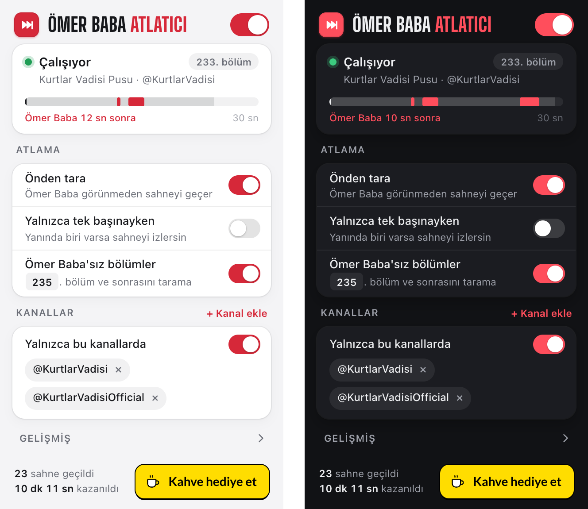

# Ömer Baba Atlatıcı

YouTube'da Kurtlar Vadisi Pusu izlerken Ömer Baba'nın (Emin Olcay) yakın ya da orta planda
olduğu sahneleri yüz tanımayla atlayan bir Chrome eklentisi. Her şey tarayıcında çalışır;
hiçbir kare dışarı gönderilmez.

[](https://www.buymeacoffee.com/kalaomer)



- **Görünmeden atlar:** YouTube'un zaten indirdiği ~20–40 saniyelik tamponu önden tarar,
  Ömer Baba ekrana gelmeden sahnenin sonuna geçer.
- **Yalnızca istediğin yerde:** Varsayılan olarak [@KurtlarVadisi](https://www.youtube.com/@KurtlarVadisi)
  ve [@KurtlarVadisiOfficial](https://www.youtube.com/@KurtlarVadisiOfficial) kanallarında
  çalışır. Başlığında 235. bölüm ve sonrası yazan (Ömer Baba'nın artık olmadığı) videolarda
  ve Shorts'ta çalışmaz.
- **Tek başına modu:** İstersen yalnızca Ömer Baba karede tek başınayken atlar, ikili çekimleri izlersin.
- **Kaçış yolları:** "Yine de izle" ve atlamadan sonra "Geri al".

## Kurulum

Derleme gerekmez; `extension/` klasörü yüklenmeye hazırdır.

1. Depoyu indir ya da klonla.
2. `chrome://extensions` sayfasını aç, sağ üstten **Geliştirici modu**nu aç.
3. **Paketlenmemiş öğe yükle** butonuna bas ve `extension/` klasörünü seç.
4. YouTube'da bir Kurtlar Vadisi Pusu videosu aç. Model ilk oynatmada ~1 saniyede yüklenir.

## Kullanım

Araç çubuğundaki ikon popup'ı açar:

- **Durum kartı:** Açık videoda eklentinin çalışıp çalışmadığı, kanal ve bölüm. Çalışırken
  canlı bir **önden tarama şeridi** gösterir: önümüzdeki 30 saniyenin ne kadarının tarandığı
  ve Ömer Baba sahnelerinin nerede olduğu (kırmızı), altında "Ömer Baba 8 sn sonra · 4 sn
  geçilecek" gibi bir not.
- **Atlama:**
  - **Önden tara:** Ömer Baba görünmeden sahneyi geçer.
  - **Yalnızca tek başınayken:** Ömer Baba karede başka biriyle birlikteyse atlamaz.
  - **Ömer Baba'sız bölümler** (varsayılan açık, 235): Başlığında bu bölüm ve sonrası yazan
    videolar taranmaz. Numara düzenlenebilir.
- **Kanallar:** "Yalnızca bu kanallarda" anahtarı ve kanal listesi. "+ Kanal ekle" ile
  `@handle`, kanal bağlantısı ya da `UC…` kimliği eklenir. Liste boşsa her kanalda çalışır.
- **Gelişmiş** (katlanır): tanıma eşiği, debug katmanı (yüz kutuları ve skorlar), sıfırlama.
- **Alt:** Toplam geçilen sahne ve kazanılan süre.

Oynatıcıda: sahne geçilirken perde iner ve ses kapanır ("Yine de izle" ile iptal edilir).
Sahne geçince sol altta bir bildirim çıkar ("18 sn atlandı · görünmeden") ve 6 saniye boyunca
**Geri al** sunar; üzerine gelince süre durur.

## Nasıl çalışır

İki katman var: **önden tarama**, Ömer Baba ekrana gelmeden sahneyi atlar. **Canlı tespit** ise
önden taramanın göremediği durumlar için yedekte bekler.

```
YouTube oynatıcısı --appendBuffer--> mse-hook.js (sayfa bağlamı) --kopya--> gölge <video> (gizli)
      |                                                                         |
      | şu anki kare                                  tamponun ~20-40 sn ilerisi |
      v                                                                         v
content.js --ImageBitmap--> gizli eklenti iframe'i --> Worker: SCRFD-500M yüz + 5 nokta -> hizalama
                                                              -> ArcFace MobileFaceNet (512-d)
                                                              -> referans merkezine kosinüs benzerliği
```

Tespit ve embedding için aynı çekirdek (`extension/core.js`) hem eklentide (onnxruntime-web)
hem de referans üretiminde (onnxruntime-node) kullanılır. Böylece referans embedding'leri ile
canlı embedding'ler aynı ön ve son işlemden geçer.

### Önden tarama (varsayılan açık)

- `mse-hook.js`, YouTube'un video tamponuna eklediği her parçayı (`appendBuffer`, `remove`,
  `abort`, `changeType`) gizli bir gölge videoya aynalar. Ek indirme yoktur; veri YouTube'un
  zaten indirdiği tampondur.
- Gölge video, oynatmanın 0.5 saniye ilerisinden tamponun sonuna kadar 1 saniyelik adımlarla
  ileri sarılıp analiz edilir. Sahne başı ve sonu 0.5 saniyeye kadar inceltilir. Gölge videoda
  bir seek 1080p'de ~20–110 ms sürer.
- Her karede çalışan bir koruma döngüsü, yaklaşan bir Ömer Baba sahnesinin hemen öncesinde
  sahnenin sonuna atlar. Ömer Baba 10 saniye görünmezse sahne bitmiş sayılır; diyalogdaki karşı
  çekimler sahneye dahildir. Devam noktası, son Ömer Baba çekiminin hemen sonrasıdır.
- Sahne tamponun ötesine uzanıyorsa perde iner, bilinen son isabete atlanır ve oradan canlı
  tespitin adım adım ilerleme mantığı devam eder.
- Tek karelik isabetler önceden atlamayı tetiklemez.
- **Histerezis:** Sahneyi başlatmak için eşik (0.36) gerekir. Sahne içinde ve sahnenin hemen
  öncesinde 0.28 ve üstü de Ömer Baba sayılır. Böylece çekime ilk girdiği ya da dönüp gittiği,
  eşiğin biraz altında kalan kareler de atlanır. Negatif videolardaki en yüksek skor 0.26'dır.

### Canlı tespit (yedek)

- Oynayan kareden saniyede 4 örnek alınır; zaman çizelgesi o anı zaten kapsıyorsa saniyede 1'e düşer.
- İlk isabette ekran karartılır ve ses kapatılır. Son 3 örneğin 2'si isabetse sahne atlanır:
  2 saniyelik adımlarla ileri sarılır, art arda 3 temiz bakışta durulur.
- Önden taramanın göremediği anlarda devreye girer: videoyu açar açmaz ya da elle bir Ömer
  Baba sahnesinin ortasına sardığında.

### Kanal filtresi

- Kanal, YouTube oynatıcısının kendi verisinden (`getPlayerResponse()`: kanal kimliği ve
  `ownerProfileUrl` içindeki `@handle`) okunur. Bu veri yalnızca sayfa bağlamından
  görülebildiği için `page-info.js` sayfa bağlamında çalışır.
- YouTube içinde başka videoya geçildiğinde oynatıcı verisi ~300 ms boyunca eski videoyu
  gösterir. Kanal kararı, oynatıcıdaki video kimliği URL'dekiyle eşleşene kadar verilmez;
  o arada eklenti hiçbir şey yapmaz.
- Liste dışı kanallarda, izleme sayfası dışında (ana sayfa önizlemeleri, Shorts) ve eklenti
  kapalıyken ne model yüklenir ne de gölge tampon tutulur. Yalnızca son init segmenti
  hatırlanır ki izinli bir videoya geçilince gölge hemen kurulabilsin.
- Filtre video ortasında kapatılırsa ya da kanal listeye eklenirse gölge tampon YouTube'un bir
  sonraki parçasıyla kurulur; önden tarama o andaki tampon süresi kadar (~20–30 sn) gecikir,
  arada canlı tespit çalışır.

### Bölüm kuralı

- Bölüm numarası video başlığından okunur. Tanınan biçimler: "233. Bölüm", "215.Bölüm",
  "235 BÖLÜM", "236. Bölümde", "Bölüm 236". "235-240 Arası Tüm Bölümler" gibi aralıklarda alt
  sınır alınır. İki kanaldan alınan 800 gerçek başlığın 266'sında numara bulundu, hiçbirinde
  hatalı değer çıkmadı.
- Başlığında bölüm numarası olmayan videolar (sahne derlemeleri, "… | Kurtlar Vadisi Pusu"
  klipleri) bilinemediği için taranmaya devam eder.
- @KurtlarVadisiOfficial kanalı orijinal Kurtlar Vadisi (2003–2005) içeriği yayınlıyor; Ömer
  Baba o dizide yok ve bölüm numaraları 97'yi geçmediği için bu kural oradaki videoları etkilemez.

### Ortak kurallar

- **Uzak çekimler yok sayılır:** Yüksekliği karenin %10'undan küçük yüzler hesaba katılmaz.
- **Tek başına modu:** Bir kare ya da tarama örneği ancak Ömer Baba karedeki tek büyük yüzse
  "Ömer Baba" sayılır. Ömer Baba'nın başka biriyle göründüğü bir kareye gelinince atlama orada
  durur, yani ikili çekimler hep izlenir. 233. bölümde Ömer Baba'nın göründüğü anların %50'sinde
  karede başka biri de var.
- **Kaçış yolları:** "Yine de izle" ve "Geri al", Ömer Baba ekranda kaldığı sürece o sahneyi
  korur; sahne bölünmez.
- Reklam oynarken analiz yapılmaz.

## Doğruluk

Referans vektörü dizinin kendi sahnelerinden çıkarılan 1.788 yüzden üretildi
(`tools/dataset.json`). Aşağıdaki sayıların hepsi depodaki araçlarla yeniden üretilebilir.

| Ölçüm | Sonuç |
|---|---|
| Ömer Baba'nın olmadığı 4 Kurtlar Vadisi bölümü (~2 saat, 4.081 yüz) | En yüksek skor 0.26; eşik (0.36) üstü **0** yüz, sahne simülasyonunda **0** atlama |
| Ayrı tutulmuş test klipleri (merkez yalnızca eğitim klipleriyle kurulur, `npm run refs:eval`) | AUC 1.000; eşikte Ömer Baba yüzlerinin %99.8'i yakalanır |
| Önden tarama, Pusu 233. bölüm (360p ve 1080p, gerçek YouTube) | Sahneler 15–20 sn önceden bulundu, Ömer Baba ekrana gelmeden atlandı; canlı örneklerde Ömer Baba **0** kez görüldü |
| Kanal filtresi, bölüm kuralı, tek başına modu, "Geri al" (gerçek YouTube) | Beklenen davranış (bkz. [Uçtan uca testler](#uçtan-uca-testler)) |

Testteki "başka kişi" kümelerinde eşik üstüne çıkan yüzlerin (%1.4) çoğu, elle bakıldığında
profilden ya da karanlıkta görünen Ömer Baba çıkıyor; `refs:eval` bunlar için bir kontak
sayfası üretir.

YouTube'un ilerleme çubuğu önizlemeleri (storyboard) de denendi: 2 saatlik bir bölümde 10
saniyede bir 320×180 kare veriyorlar. 21 gerçek sahnenin yalnızca 14'ünü yakaladılar ve Ömer Baba
süresinin %38'ini kapsadılar, bu yüzden kullanılmıyor (`tools/experiments/`).

## Model üretimi

> Eklentiyi kullanmak için bu bölüme gerek yok: yüz modelleri ve Ömer Baba referansı depoda
> hazır. Bu bölüm, referansı kendi makinende sıfırdan üretmek, veri setini değiştirmek ya da
> eklentiyi başka bir kişi için uyarlamak isteyenler için.

Eklentinin tanıdığı yüz, `extension/refs/omer.json` içindeki tek bir 512 boyutlu vektördür.
Aşağıdaki hat bu dosyayı sıfırdan üretir: videoları YouTube'dan indirir, her saniyeden yüzleri
çıkarır, Ömer Baba'nın yüzlerini kümeleyip ortalamasını alır. Deponun temiz bir kopyasında
baştan sona denendi (Eylül 2026): yeni indirilen videolarla depodakiyle birebir aynı dosya çıktı.
YouTube ileride videoları farklı kodlarsa sonuç çok küçük farklarla değişebilir.

### Gerekenler

- **Node 20+:** Yüz çıkarma ve testler için; yt-dlp de YouTube'a erişirken Node'u kullanır.
- **[uv](https://docs.astral.sh/uv/):** Python 3.12'yi ve Python paketlerini (`tools/requirements.txt`)
  kendisi kurar; ayrıca Python kurman gerekmez.
- **ffmpeg** (ffprobe ile birlikte).
- **~1 GB boş disk.**

macOS'ta `brew install node uv ffmpeg`; Linux'ta dağıtımının paket yöneticisiyle `nodejs` ve
`ffmpeg`, uv için [kurulum betiği](https://docs.astral.sh/uv/getting-started/installation/).

### Adımlar

Depo kök klasöründe:

```bash
npm install
npm run data:download    # 21 videoyu data/videos/ altına indirir (~500 MB, ~2 dk)
npm run data:faces       # kareleri ayıklar, yüzleri bulur, hizalar, embedding çıkarır -> data/faces/ (~6 dk)
npm run refs:build       # Ömer Baba kümesini bulur, merkezi hesaplar -> extension/refs/omer.json (~15 sn)
```

Süreler hızlı bir bağlantı ve Apple Silicon bir Mac içindir; toplam ~8 dakika.

Sonra `data/reports/tohum-kume.jpg` dosyasını aç ve **en üst satırın ("TOHUM") gerçekten Ömer
Baba olduğunu gözle doğrula.** Hattaki tek elle yapılan adım budur. Doğruysa eklentiyi
`chrome://extensions` sayfasından yenile; yeni referans kullanılmaya başlar.

İsteğe bağlı raporlar:

```bash
npm run refs:eval        # ayrı tutulmuş veride başarı + sınırdaki yüzlerin kontak sayfası -> data/reports/
npm run report:episode   # 233. bölümün Ömer Baba zaman çizelgesi (e2e testlerinde başlangıç zamanı seçmek için)
```

Bir adım yarıda kalırsa tekrar çalıştırmak güvenlidir: `data:download` inmiş videoları atlar,
diğer adımlar çıktılarını baştan yazar.

### Ne üretilir

```
data/                                   (git dışı; depoya girmez)
  videos/{train,test,neg,episode}/      indirilen videolar: yalnızca görüntü, ses yok (AV1 .mp4 / VP9 .webm)
  faces/{train,test,neg,episode}/       meta.jsonl (yüz başına bir satır), emb.f32 (embedding'ler), crops/ (112x112 yüzler)
  reports/                              tohum-kume.jpg, sinir-yuzler.jpg, bolum.json
  storyboard/<id>/                      yalnızca storyboard deneyi için
extension/refs/omer.json                eklentinin kullandığı referans (depoda)
```

Videolar Mac'in QuickTime/Önizleme uygulamasında açılmayabilir: WebM ve AV1'i desteklemiyor
(AV1'i yalnızca M3 ve sonrası çiplerde açar). Bozuk değiller; Chrome, VLC ya da IINA ile açılır.
Referansı yeniden üretmek için videolara ihtiyaç yoktur, `data/faces/` yeterlidir; videolar ancak
yüzleri baştan çıkarmak için gerekir.

### Araçlar

| Adım | Araç | Ne yapar |
|---|---|---|
| Veri seti | `tools/dataset.json` | Video kimlikleri: `train` ve `test` Ömer Baba sahneleri, `neg` Ömer Baba'nın olmadığı orijinal Kurtlar Vadisi bölümleri, `episode` tam bir Pusu bölümü (233) |
| İndirme | `tools/download-videos.py` | Yalnızca görüntü akışı, 480p (tam bölüm 360p); inmiş videoları atlar |
| Yüz çıkarma | `tools/extract-faces.mjs` | ffmpeg'ten ham kare okur, eklentinin çekirdeğiyle yüz bulur, 112×112 hizalı kırpıntı ve embedding yazar |
| Referans | `tools/build-refs.py` | Büyük ve net yüzleri kümeler; en büyük küme Ömer Baba'dır. Merkezini, ona 0.45'ten yakın tüm yüzlerle (profil ve karanlık sahneler) bir tur iyileştirir |
| Değerlendirme | `tools/evaluate.py` | Merkezi yalnızca eğitim verisiyle kurar; test ve negatif videolarda AUC, eşikte yakalama, sahne simülasyonu |
| Bölüm raporu | `tools/episode-report.py` | Sahne listesi ve "tek başına" istatistiği |
| Deney | `tools/experiments/` | Reddedilen storyboard yaklaşımı ve karşılaştırması |
| Ortak kod | `tools/facedata.py` | Yükleme, kümeleme, merkez ve kontak sayfası |

### Sorun giderme

- **İndirmede 403 ya da "Sign in to confirm you're not a bot":** YouTube eski yt-dlp sürümlerini
  engeller. `data:download` her çalıştırmada yt-dlp'yi en güncel sürüme yükseltir; hata sürerse
  bir süre sonra tekrar dene.
- **Bir video indirilemedi (kaldırılmış ya da erişime kapanmış):** `data:download` sonunda
  indirilemeyenleri listeler ve hata koduyla biter. Sonraki adımlar inen videolarla çalışır;
  referans biraz farklı çıkar, `refs:build` çıktısındaki negatif skorları kontrol et.
- **`ffmpeg`/`ffprobe` bulunamadı:** ffmpeg kurulu ve `PATH` içinde olmalı.

### Başka bir kişi için uyarlamak

1. `tools/dataset.json` içinde `train` ve `test` listelerine o kişinin yakın ya da orta planda
   çok göründüğü klipleri (farklı sahne ve ışıklardan 10–15 video), `neg` listesine o kişinin hiç
   olmadığı ama benzer içerikli videoları koy.
2. `npm run data:download && npm run data:faces && npm run refs:build`.
3. `tohum-kume.jpg`'de en üst satır o kişi olmalı. Başka biriyse (örneğin kliplerde sürekli
   karşısında duran oyuncu), o kişinin daha baskın olduğu klipler ekle; yöntem en büyük kümeyi seçer.
4. `npm run refs:eval` çıktısına bakarak eşiği seç: negatif videolardaki en yüksek skorun
   üstünde, kişinin yüzlerinin çoğunun altında olmalı (`build-refs.py --threshold`).
5. Arayüz metinleri (`extension/popup.html`, `extension/content.js`), varsayılan kanallar
   (`extension/channels.js`) ve bölüm kuralı (`episodeFrom`, `extension/content.js` ile
   `extension/popup.js`) Ömer Baba'ya özeldir; kendi durumuna göre değiştir.

### Yüz modelleri ve diğer dosyalar

Depoda hazır durur; sıfırdan almak istersen:

```bash
npm run models:fetch     # InsightFace buffalo_sc'yi indirir, çıktı boyutlarını dinamik yapar
npm run setup:vendor     # onnxruntime-web ve popup fontları -> extension/
npm run setup:icons      # eklenti ikonları
npm run setup:button     # README'deki "Kahve hediye et" butonu (assets/)
npm run store:assets     # Chrome Web Store ikonu, ekran görüntüleri ve tanıtım görselleri (store/)
npm run package          # Web Store'a yüklenecek paket: dist/omer-baba-atlatici-<sürüm>.zip
```

Web Store panelindeki tüm alanların değerleri: [store/listing.md](store/listing.md).

## Geliştirme

### Uçtan uca testler

`tools/e2e.mjs`, eklentiyi Playwright'ın Chromium'una yükleyip gerçek bir YouTube videosunu
oynatır; eklentinin durumunu, video zamanındaki sıçramaları (atlanan sahneler) ve ekranda
görülen Ömer Baba örneklerini saniye saniye raporlar. İlk seferde Playwright'ın tarayıcısını
kur: `npx playwright install chromium`.

```bash
npm run test:e2e                                          # önden tarama: 70:48'deki sahneden önce başla
node tools/e2e.mjs VDtf9lAmpvM 45 data/shots              # Ömer Baba yoğun klip, ekran görüntüleriyle
node tools/e2e.mjs IPwAfYRNtlA 45                         # Ömer Baba yok: atlama olmamalı
node tools/e2e.mjs 3kS_bojhZt8 40 --start=300             # liste dışı kanal: pasif kalmalı
node tools/e2e.mjs 3kS_bojhZt8 40 --start=300 --nofilter  # aynı video, filtre kapalı: atlamalı
node tools/e2e.mjs mTZTz3yT3PA 45 --start=4440 --alone    # tek başına modu: ikili çekimleri atlamamalı
node tools/e2e.mjs pO2ilL85kzk 15 --start=600             # 235. bölüm: pasif kalmalı
node tools/e2e.mjs 9wlOufboEpo 20 --shorts --nofilter     # Shorts: pasif kalmalı
node tools/e2e.mjs VDtf9lAmpvM 30 --undo                  # "Geri al" akışı
node tools/e2e.mjs mTZTz3yT3PA 40 --start=4800 --quality=hd1080 --ranges  # 1080p seek maliyeti, tampon aynalama
```

YouTube, Playwright'ın Chromium'una medya zamanında yaklaşık ilk 60 saniyeden fazla akış
vermiyor (bot doğrulaması; eklenti kapalıyken de olur). Uzun testleri normal Chrome'da yapmak gerekir.

### Dosya düzeni

```
extension/          Chrome eklentisi (MV3), yüklenmeye hazır
  core.js           ortak yüz hattı (tespit, hizalama, embedding)
  content.js        oynatıcıdaki mantık: canlı tespit, önden tarama, perde, bildirim
  mse-hook.js       sayfa bağlamı: YouTube tamponunu gölge videoya aynalar
  page-info.js      sayfa bağlamı: kanal ve başlık bilgisi
  worker.js         çıkarım worker'ı (onnxruntime-web)
  popup.*           arayüz
  refs/omer.json    Ömer Baba referans vektörü
tools/              model üretimi, değerlendirme ve testler
assets/             README görselleri
data/               indirilen videolar ve ara çıktılar (git dışı)
```

## Gizlilik ve veri

Ayrıntılı gizlilik politikası: [PRIVACY.md](PRIVACY.md).

- Tüm işlem tarayıcında yapılır. Eklentinin kendi ağ isteği yoktur; kareler, yüzler ve
  ayarlar cihazından çıkmaz.
- Depo video, kare ya da yüz görüntüsü içermez. `tools/dataset.json` yalnızca video
  kimliklerini listeler; indirilen veri `data/` altında, git dışında kalır.
- `extension/refs/omer.json`, 1.788 yüz embedding'inin ortalaması olan tek bir vektördür;
  ondan yüz görüntüsü pratikte geri üretilemez.

## Sınırlar

- DRM'li içerikte (kiralık filmler vb.) kareler okunamaz; eklenti devre dışı kalır.
- Önden tarama yalnızca YouTube'un tamponladığı kısmı görebilir (genelde 20–40 sn). Videoyu
  açınca ya da elle ileri sarınca ilk saniyelerde canlı tespit devrededir; Ömer Baba perde
  inmeden önce kısa bir an görünebilir.
- Önden tarama, YouTube'un sayfa bağlamında `MediaSource` kullanmasına dayanır. YouTube bunu
  ileride bir Worker'a taşırsa gölge tampon boş kalır; eklenti otomatik olarak yalnızca canlı
  tespitle çalışmaya devam eder (debug katmanında "gölge tampon yok" yazar).
- Tanıma yüze dayanır: arkadan ya da çok uzaktan görünen Ömer Baba sayılmaz.

## Lisans

Proje kodu [MIT](LICENSE) lisanslıdır.

İstisna: `extension/models/` altındaki yüz modelleri (InsightFace `buffalo_sc`) MIT lisansına
dahil değildir; InsightFace'in kendi lisansıyla dağıtılırlar ve yalnızca ticari olmayan
kullanıma izin verirler. Diğer üçüncü taraf bileşenler (onnxruntime-web, fontlar) kendi
lisanslarıyla gelir; ayrıntılar [THIRD_PARTY_NOTICES.md](THIRD_PARTY_NOTICES.md).

## Destek

Proje işine yaradıysa bir kahve ısmarlayabilirsin:

[](https://www.buymeacoffee.com/kalaomer)
